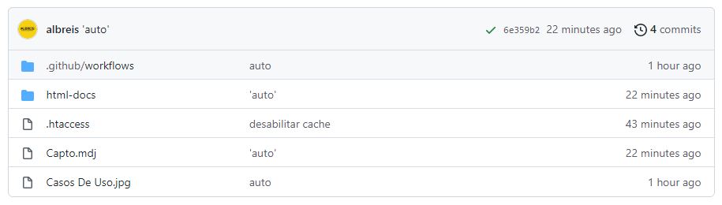

# GitPush - Extensão para StartUML

## Dependencias

Você precisa ter instalado em seu ambiente:

StartUML https://staruml.io

NodeJS https://nodejs.org

Git https://git-scm.com

## Instalação

Clone o repositório dentro do diretório de extensões do usuário:

Exemplo no Windows:
```
C:\Users\[your-user]\AppData\Roaming\StarUML\extensions\user
```

Execute o commando:

```
npm install
```
ou 
```
yarn install
```

Pronto! 

Basta abrir ou reiniciar o StarUML que a extensão estará ativa.


# Exemplo

